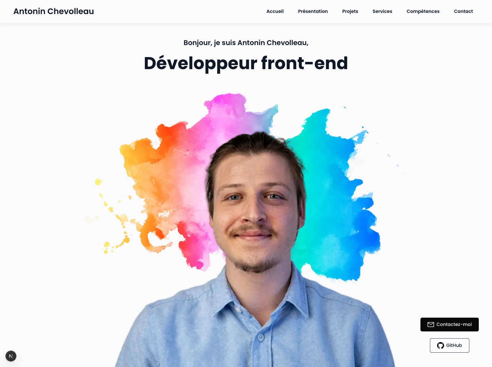

# Mon Portfolio

Portfolio de développeur front-end — Antonin Chevolleau.

## Screenshot



## Stack technique

- **Framework** : [Next.js](https://nextjs.org/) (App Router)
- **Langage** : JavaScript / JSX
- **Style** : Tailwind CSS
- **Animations** : Framer Motion

## Installation

### Prérequis

- Node.js >= 18
- npm ou yarn

### Lancer le projet en local

```bash
git clone https://github.com/Drack0r/my-portfolio.git
cd my-portfolio
npm install
npm run dev
```

Ouvrir [http://localhost:3000](http://localhost:3000) dans le navigateur.

### Build de production

```bash
npm run build
npm run start
```

## Structure du projet

```
src/
├── app/                  # Routes Next.js (App Router)
├── components/
│   ├── sections/         # Sections de la page (Hero, Projets, etc.)
│   ├── navigation/       # Composants de navigation
│   └── ...
├── variants/             # Variants d'animation Framer Motion
public/
└── images/               # Assets statiques
```

## Contact

- **Email** : antochevolleau@gmail.com
- **GitHub** : [github.com/Drack0r](https://github.com/Drack0r)
